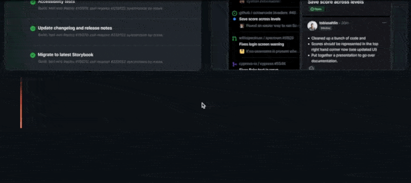
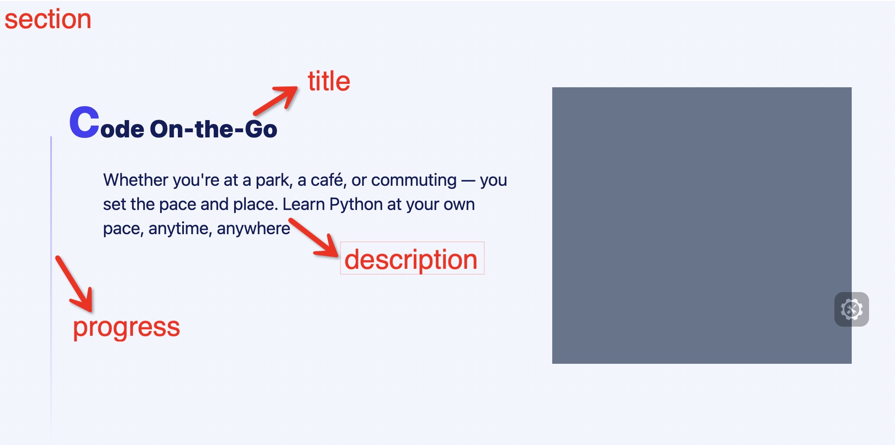

# 前言

最近接到一个做网站官网的需求，官网的页面元素需要有一些动画效果，来增加页面的活力。很多网站的官网都有一个共同的特点，就是滚动页面的时候，页面上的元素会有一些出场动画效果，比如元素的移动、旋转、缩放、透明度变化等等，这些动画效果都是通过滚动页面来驱动的，这种方式可以让页面看起来更加的生动，也可以让用户更加的有参与感，这种方式也是一种很好的用户体验。

# 动画效果

设计小姐姐在提供动画效果示例的时候，让我参考 github 的官网，github 的官网的动画效果是这样的：



可以看到页面在滚动到这个模块的时候，这个模块的标题、内容和左侧的进度条都有动画效果，其中标题和内容是从左侧滑动进来的，而且有一个透明度的变化，进度条是从上向下增加高度的，这样的动画效果看起来很酷炫，而且也很有层次感。

# 实现思路

我们可以看到，这个动画效果是由滚动页面来驱动的，当页面滚动到这个模块的时候，这个模块的标题、内容和左侧的进度条才会有动画效果。

说到滚动驱动动画，自然想到了比较新的 css 属性 `view-timeline`，这个属性可以让我们在滚动到某个元素时，根据元素和视口的相对位置来控制动画的进度，这个属性的使用方法可以参考[这里](https://developer.mozilla.org/en-US/docs/Web/CSS/view-timeline)。

接下来，我们来用 `view-timeline` 来实现这个动画效果。

1. 定义我们需要的元素,如下图所示：



整块区域添加 class `section`,标题部分元素 class 为`section-title`,描述部分为`section-des`,进度条为`section-progress`。

2. 定义动画效果

侧滑的动画效果：

```css
@keyframes slideInLeft {
  from {
    transform: translateX(-15px);
    opacity: 0;
  }
  to {
    transform: translateX(0);
    opacity: 1;
  }
}
```

进度条的动画效果：

```css
@keyframes progress {
  from {
    transform-origin: top;
    transform: scaleY(0);
  }
  to {
    transform-origin: top;
    transform: scaleY(100%);
  }
}
```

3. 给 section 元素添加 `view-timeline` 属性

```css
.section {
  view-timeline: --sectionReveal;
}
```

4.  给标题、描述和进度条添加 对应的动画效果

```css
.section-title {
  animation-timeline: --sectionReveal;
  animation-name: slideInLeft;
  animation-range: entry 40% entry 60%;
  animation-fill-mode: both;
}
.section-des {
  animation-timeline: --sectionReveal;
  animation-name: slideInLeft;
  animation-range: entry 50% entry 70%;
  animation-fill-mode: both;
}
.section-progress {
  animation-timeline: --sectionReveal;
  animation-name: progress;
  animation-range: entry 50% entry 70%;
  animation-fill-mode: both;
}
```

在上面的代码中，我们指定了动画的时间轴 `--sectionReveal`，然后给标题、描述和进度条添加了对应的动画效果，这样当页面滚动到这个模块的时候，这个模块的标题、描述和进度条就会有动画效果了。

其中值得注意的是 `animation-range` 这个属性，我们可以通过这个属性指定动画的开始时间和结束时间，比如 `animation-range: entry 50% entry 70%;`指定了动画开始时机为：section 元素进入视口的 50% 时刻，动画结束时机为：section 元素进入视口的 70% 时刻。可以通过指定不同的开始时机，让动画有层次感。

最后看看效果：


是不是和 github 官网的效果差不多呢

# 最后

`view-timeline` 这个属性还是比较新的，浏览器的支持度不是特别高，所以在实际项目中使用的时候，还需要考虑兼容性的问题。那么不用这种方式，又该如何实现这个类似的效果呢？
