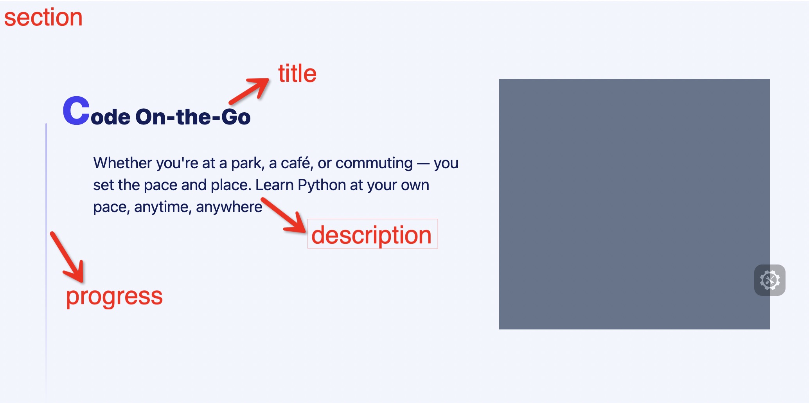

# 前言

上篇文章介绍了使用 `view-timeline` 实现的滚动驱动动画，当我拿着 demo 给产品经理看的时候，产品经理说：这个效果不错。然后我说：“但是这种实现方案兼容性不太好，只有最近几个版本的 Chrome 浏览器才支持，能接受吗？” 产品经理：“当然不行！”，于是有了这篇文章，我们来看看如何基于 `IntersectionObserver` 来实现兼容性更好的类似动画效果，可以称为滚动触发动画的方案。

# IntersectionObserver

IntersectionObserver API 是一种用于监听页面元素可见性变化的浏览器 API。它提供了一种通过观察目标元素与其祖先或视窗（viewport）之间的交叉区域来实现延迟加载、懒加载，或者自动执行其他操作的方式。

使用 IntersectionObserver API ，可以通过创建一个观察器（observer），并指定一个回调函数来监听一个或多个目标元素。当目标元素被观察到进入或离开视窗或其祖先元素交叉区域时，观察器会自动调用回调函数。

使用 Intersection API 基本步骤如下：

1.  创建一个观察器对象：可以通过实例化 IntersectionObserver 类并传入一个回调函数来创建观察器。
    IntersectionObserver API 中的 option 参数用于设置观察器对象的配置选项。这些选项可以影响观察器对象的行为，允许你自定义观察目标元素时的交叉区域和阈值。
    option 参数是一个对象，可包含以下属性：

        1. `root`：指定观察器的根元素，它可以是一个 DOM 元素或一个视窗对象。默认值为浏览器视窗（viewport）。

        2. `rootMargin`：指定观察器相对于根元素（root）的边界偏移量。可以为负值或百分比。默认值为"0px 0px 0px 0px"，表示不偏移。

        3. `threshold`：指定一个阈值数组，用于确定何时将目标元素视为可见。阈值可以是介于0和1之间的任何数值，表示目标元素交叉区域与目标元素的比例。默认值为[0]，表示当目标元素的任何部分进入根元素时触发回调。
        ```js
        const observer = new IntersectionObserver(callback,option);
        ```

2.  指定要观察的目标元素：通过调用观察器对象的 observe() 方法并传入目标元素，将目标元素添加到观察列表中。

```js
const targetElement = document.querySelector("#target");
observer.observe(targetElement);
```

3. 编写回调函数：定义一个回调函数，该函数会在目标元素的可见性变化时被调用，可以在这个函数中执行相应的操作，比如懒加载图片、运行动画等。

```js
function callback(entries, observer) {
  entries.forEach((entry) => {
    if (entry.isIntersecting) {
      // 目标元素进入了视窗或祖先元素的交叉区域
      console.log("Element is visible!");
      // 执行一些操作，比如加载图片、运行动画等
    } else {
      // 目标元素离开了视窗或祖先元素的交叉区域
      console.log("Element is not visible!");
      // 执行其他操作
    }
  });
}
```

4. 处理观察结果：在回调函数中通过观察器对象的 entries 属性可以获取到一个 IntersectionObserverEntry 对象的数组，每个对象表示一个目标元素的可见性情况，包括目标元素与视窗交叉区域的大小、位置等信息。

使用 IntersectionObserver API 的好处是，可以避免使用繁琐的事件监听器来监测元素的可见性变化，同时也能提高性能，因为观察器是由浏览器内部来处理的，可以通过懒加载来减少页面加载时的网络请求和资源消耗。

总之，IntersectionObserver API 可以帮助开发者更便捷地监听元素可见性的变化，实现一些有趣的效果和性能优化，是一个非常有用的浏览器 API。

# 实现思路

因为现在项目使用 Tailwind CSS 作为样式方案，所以这里的实现思路是基于 Tailwind CSS 的，当然，如果你使用的是其他的样式方案，也可以参考这个思路来实现。

1. 封装一个容器组件，用来监听自身的可见性变化，并在容器元素上添加可见状态的 class，比如`visible`，同时这个组件需要一个 `group` class ,用来标识这个组件是一个组，这样可以方便我们在组件外部控制组内的动画效果。
2. 内部元素通过 group 元素当前是否含有 visible class 来决定是否添加动画效果。
3. 基于 transition 实现动画效果。

## 封装容器组件

```tsx
export const ViewAnimation = (props) => {
  const { children, startThreshold = 0.85, endThreshold = 0.25 } = props;
  const ref = useRef(null);

  useEffect(() => {
    const observer = new IntersectionObserver(
      (entries) => {
        entries.forEach((entry) => {
          if (
            entry.isIntersecting &&
            entry.intersectionRatio >= startThreshold
          ) {
            entry.target.classList.add("visible");
          } else if (
            !entry.isIntersecting &&
            entry.intersectionRatio <= endThreshold
          ) {
            entry.target.classList.remove("visible");
          }
        });
      },
      {
        threshold: [endThreshold, startThreshold],
      }
    );
    if (ref.current) {
      observer.observe(ref.current);
    }
    return () => {
      if (ref.current) {
        observer.unobserve(ref.current);
      }
    };
  }, []);

  return (
    <div className="group" ref={ref}>
      {children}
    </div>
  );
};
```

这里我定义了两个阈值，`startThreshold` 和 `endThreshold`，当组件的可见比例大于 `startThreshold` 且可见区域在扩大时，给组件添加 `visible` class，当组件的可见比例小于 `endThreshold`且可见区域在缩小时，移除 `visible` class。

这里的 `startThreshold` 和 `endThreshold` 的默认值分别为 0.85 和 0.25，这两个值是经过测试得出的，可以根据实际情况进行调整。

## 内部元素的添加动画效果

同样有以下内部元素：



```tsx
<ViewAnimation>
  ...
  {/* 标题*/}
  <div className="... translate-x-[-15px] opacity-0 group-[.visible]:translate-x-0 group-[.visible]:opacity-100 ease-slide duration-700 transition">
    {title}
  </div>
  {/* 描述*/}
  <div className="... translate-x-[-15px] opacity-0 group-[.visible]:translate-x-0 group-[.visible]:opacity-100 ease-slide duration-700 transition delay-150">
    {description}
  </div>
  {/* 进度条*/}
  <div className="... origin-top scale-y-0 group-[.visible]:scale-y-100 ease-slide duration-700 transition delay-500"></div>
</ViewAnimation>
```

可以看到，我们将需要触发动画的模块包裹在 `ViewAnimation` 组件内，然后，对于需要动画的元素，添加初始的一些 transform 和 opacity 属性，然后通过 `group-[.visible]` 来改变这些值，从而配合 `transition` 实现动画效果。

看看最终效果：


## 总结

这种方式实现的动画效果兼容性更好，但是它跟`view-timeline`的实现方式相比，还是有区别的，这是方式是一种滚动触发动画的方案，而`view-timeline`是一种滚动驱动动画的方案，其实就是动画的时间函数不同，滚动驱动的动画函数是由滚动决定的，动画是可中断的。而 transition 和 animation 的动画是可以指定不同的缓动函数的，动画不可中断，触发后就会执行完动画。

只不过，在本文的场景下，两种技术都可以实现类似的效果。
