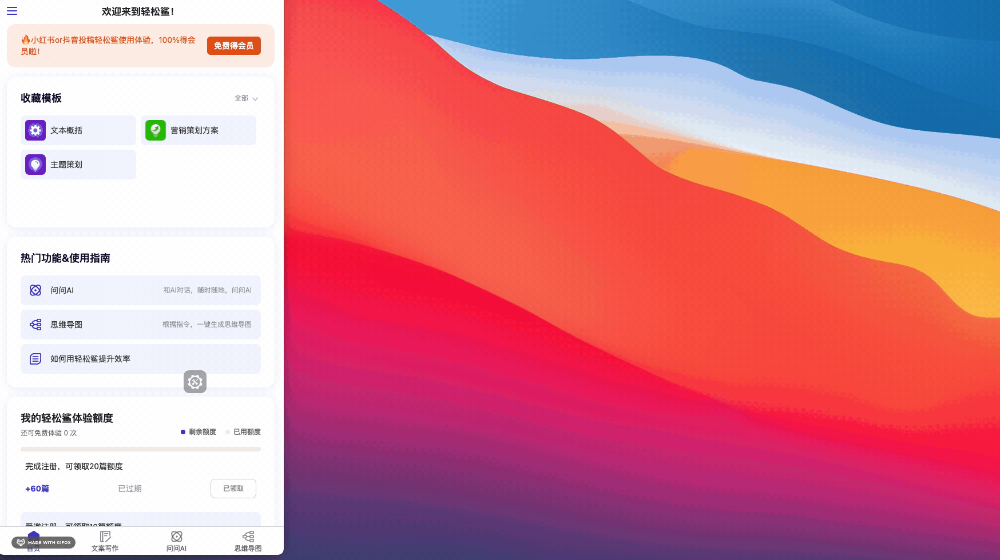
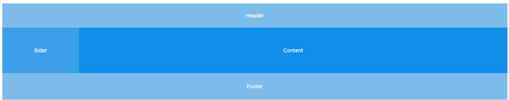
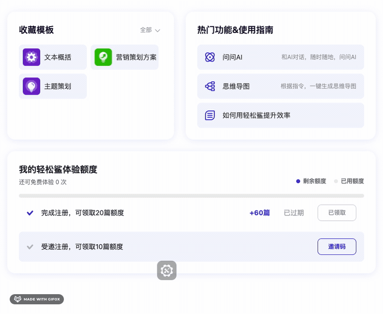
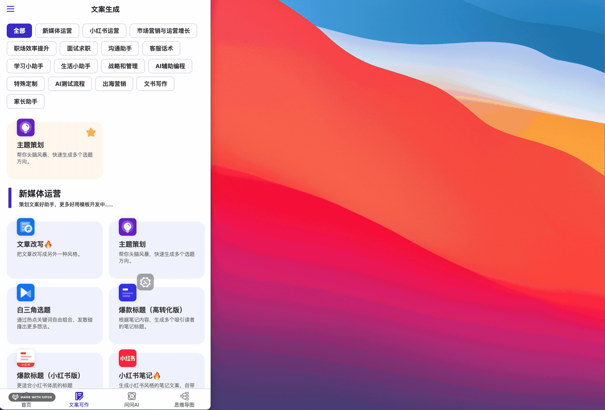

# 基于 tailwindcss 的多端自适应布局方案

近期，我在做一个项目。老板希望我们的产品在不同的设备上都能有良好的用户体验，同时，为了节省人力成本，希望在同一套代码上去针对不同的屏幕尺寸去做样式适配。因为我选择了 tailwindcss 作为 css 框架，所以我就想能不能基于 tailwindcss 去做一套多端自适应的布局方案呢？经过一番研究，我发现，tailwindcss 的响应式断点设置非常灵活，可以满足我们的需求。使用断点工具类，可以避免在写大量的媒体查询 css,使用下来发现还是非常方便的。下面，我就来介绍一下我是如何基于 tailwindcss 去做一套多端自适应的布局方案的。

## 响应式断点设置

以下是 tailwindcss 默认的 5 个断点：

| 断点前缀 | 宽度   | css                                |
| -------- | ------ | ---------------------------------- |
| sm       | 640px  | @media (min-width: 640px) { ... }  |
| md       | 768px  | @media (min-width: 768px) { ... }  |
| lg       | 1024px | @media (min-width: 1024px) { ... } |
| xl       | 1280px | @media (min-width: 1280px) { ... } |
| 2xl      | 1536px | @media (min-width: 1536px) { ... } |

tailwindcss 采用 `Mobile First`的策略，即不加前缀的工具类都是针对小屏幕的，加了前缀的工具类都是针对大屏幕的。比如，`text-center`是针对小屏幕的，`md:text-center`是针对大屏幕的。因为 tailwindcss 的第一个断点屏幕尺寸是 640px,但其实最大的手机屏幕宽度也不过 480px,所以，如果你有一些针对手机端的特殊布局，可以考虑加一个断点：

```js
// tailwind.config.js
module.exports = {
    ...,// 其他配置
    theme: {
        screens: {
            xs: '480px',
            ...defaultTheme.screens,
        },
    },

}
```

针对以上断点，我和设计师讨论后达成一致，针对每个页面，设计师一般至少出 3 套布局设计，分别应用于手机端、平板端、PC 端。我们认为屏幕尺寸小于 480px 为手机端，480px 到 1024px 为平板端，1024px 到 1280px 之间为大 pad 尺寸和小笔记本屏幕的混合区。大于 1280px 为 PC 端。设计师可以选择在任意断点上做布局变化，以细粒度的控制自适应的布局效果。

## 页面整体布局

设计师给出的布局方案是这样的：

手机和 pad 端：上中下布局，上下固定高度，中间自适应

pc 端：左右布局，左边固定宽度，右边自适应

效果如下：



要实现这样的效果，我们一开始就要把使用这样的布局方案：



在手机端，我们把侧边栏（Sider)隐藏掉，只显示主内容区（Content）,在 pc 端，我们把 Header 和 Footer 隐藏，将 Sider 展示。伪代码如下：

```jsx
<Layout>
  <Header className="lg:hidden"></Header>
  <Layout>
    <Sider className="hidden lg:block" />
    <Content></Content>
  </Layout>
  <Footer className="lg:hidden"></Footer>
</Layout>
```

## 使用 flex 做局部的布局调整

在布局框架定下来后，就是局部的布局变化了，常见的就是在某个断点后，需要把原来的水平布局变成垂直布局，或者反过来。如下图：



这时候，我们可以使用 flex 布局来实现。可以这样做：

```jsx
<div className="flex flex-col md:flex-row">
  <div className=" md:flex-1"></div>
  <div className=" md:flex-1"></div>
</div>
```

## 使用 grid/flex 做水平列表自适应

在某些场景下，我们需要实现水平列表的自适应，要求如下：

1. 列表项个数不定，支持多行排列
2. 在不同断点下，同一行展示不同的列数
3. 在同一个断点下，列表的宽度自适应

如下图：



可以使用 flex+百分比 来实现：

```jsx
<div className="flex flex-wrap px-2">
  {items.map((item) => (
    <div className="shrink-0 max-w-1/2 basis-1/2 sm:max-w-1/3 sm:basis-1/3 lg:max-w-1/4 lg:basis-1/4 ..."></div>
  ))}
</div>
```

另外也可以使用 grid 布局来实现：

```jsx
<div className="grid grid-cols-2 sm:grid-cols-3 lg:grid-cols-4 ...">
  {items.map((item) => (
    <div></div>
  ))}
</div>
```

## js 获取布局情况

某些情况下，我们可能需要在事件回调中获取当前所处的断点和布局情况，比如，我们需要在点击某个按钮后，获取当前的布局情况，然后根据布局情况做一些处理。

```js
const handleClick = () => {
  if (window.innerWidth < 480) {
    // do something for mobile
  } else if (window.innerWidth < 1024) {
    // do something for pad
  } else {
    // do something for pc
  }
};
```

`480`和`1024`是我们自己定义的断点，可以保存成常量，并与 tailwindcss 的断点保持一致。

但是这种方式有个问题，就是当我们在浏览器中调整窗口大小时，断点和布局情况是会变化的，js 执行的时候，可能已经不是我们当前的断点和布局情况了。

可能的场景是 pad 旋转屏幕和 开发过程中调整浏览器窗口大小来模拟不同端的设备，这时候，我们需要在窗口大小变化时，重新获取当前的断点和布局情况。

我们可以实现一个 Context Provider 来提供当前屏幕宽度和断点信息，然后在窗口大小变化时，更新这些信息。

```jsx
import React, { createContext, useState, useEffect } from "react";

const ScreenContext = createContext();

const ScreenProvider = ({ children }) => {
  const [screenWidth, setScreenWidth] = useState(window.innerWidth);
  const [screenBreakpoint, setScreenBreakpoint] = useState("");

  useEffect(() => {
    const handleResize = () => {
      setScreenWidth(window.innerWidth);
      if(window.innerWidth >= 1536) {
        setScreenBreakpoint("2xl")
      } else if(window.innerWidth >= 1280) {
        setScreenBreakpoint("xl")
      } else if(window.innerWidth >= 1024) {
        setScreenBreakpoint("lg")
      } else if(window.innerWidth >= 768) {
        setScreenBreakpoint("md")
      } else if(window.innerWidth >= 640) {
        setScreenBreakpoint("sm")
      } else if(window.innerWidth >= 480)) {
        setScreenBreakpoint("xs")
      }else{
        setScreenBreakpoint("")
      }
    };
    window.addEventListener("resize", handleResize);
    return () => {
      window.removeEventListener("resize", handleResize);
    };
  }, []);

  return (
    <ScreenContext.Provider value={{ screenWidth, screenBreakpoint }}>
      {children}
    </ScreenContext.Provider>
  );
};
const useScreen = () => {
  const { screenWidth, screenBreakpoint } = useContext(ScreenContext);
  return { screenWidth, screenBreakpoint };
};

export { ScreenContext, ScreenProvider, useScreen };
```

这样我们就可以在任意组件中通过 useScreen hook 获取当前的屏幕宽度和断点信息了。

但是这个方案还有一个小缺点就是我们维护了两份断点的信息，分别放在 tailwind.config.js 中和 ScreenProvider 中，如果我们修改了 tailwind.config.js 中的断点信息，那么 ScreenProvider 中的断点信息也要做相应的修改。

## 注意事项

1. 交互设计

   大屏情况下，页面有足够的地方容纳元素，但是，适配到手机端，有些区域就没地方显示了，一般会采用弹框的形式来显示被隐藏的区域。

2. 关于 hover

   hover 效果应该只应用在 PC 端，因为手机端点击会触发 hover 效果，而且必须点击其他位置，才能取消掉 hover 效果，所以，如果我们要实现一个在 PC 上有 hover 效果，在手机上没有 hover 效果的按钮，可以这样做：

```jsx
<button className=" lg:hover:bg-blue-500"></button>
```

3. code split

   大多数情况下，一个用户只会看到某个断点下的页面，所以，我们可以根据当前的断点，来决定加载哪些组件，这样可以减少不必要的代码加载，减少 js 体积，提高页面加载速度。比如，我们的 Sider 内的侧边导航栏组件只在`lg`断点后显示，那么我们可以这样做：

```jsx
const SiderMenu = React.lazy(() => import("./SiderMenu"));

const App = () => {
  const { screenBreakpoint } = useScreen();
  return (
    <Layout>
      <Header className="lg:hidden"></Header>
      <Layout>
        <Sider className="hidden lg:block">
          {["lg", "xl", "2xl"].includes(screenBreakpoint) && (
            <Suspense fallback={null}>
              <SiderMenu />
            </Suspense>
          )}
        </Sider>

        <Content>...</Content>
      </Layout>
      <Footer className="lg:hidden"></Footer>
    </Layout>
  );
};
```

## 总结

基于 tailwindcss 的多端自适应布局方案，可以让我们在同一套代码上去针对不同的屏幕尺寸去做样式适配，可以大大减少我们的开发成本。但是，这要求前端开发和设计师能够协同工作，设计师需要提供不同断点下的布局设计，前端开发需要根据设计稿去实现不同断点下的布局。这样，我们才能实现一套代码，多端自适应的布局方案。
