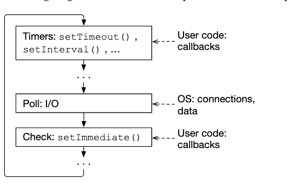
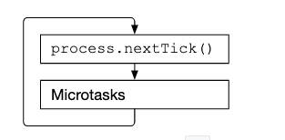

js 引擎是单线程的，为了保证不阻塞，js 引擎会将任务分为两种，一种是同步任务，一种是异步任务。同步任务会在主线程上排队执行，异步任务会在任务队列中排队等待，一旦主线程空闲，就会从任务队列中取出任务执行。任务队列中的任务分为两种，一种是宏任务，一种是微任务。宏任务包括：script(整体代码)、setTimeout、setInterval、setImmediate（Nodejs）、I/O(Nodejs)、UI rendering(Brower)，微任务包括：process.nextTick(Nodejs)、Promise、MutationObserver(Brower)。V8 引擎通过事件循环的机制来实现异步任务的调度。

## 事件循环机制

1. `每一个宏任务(注意不是宏任务队列)`运行结束，会检查微任务队列，如果有微任务，就会依次执行微任务，直到微任务队列为空。
2. 宏任务运行过程中产生的宏任务不会在当前轮次中处理，而微任务运行过程中产生的微任务会在当前轮次中处理。（因为新产生的微任务会被添加到微任务队列的末尾，而微任务队列是在当前轮次中要被清空的）

## 浏览器端的事件循环

通过以下代码来理解浏览器端的事件循环机制：

```js
console.log("1"); //同步任务
setTimeout(function () {
  //宏任务
  console.log("2");
  new Promise(function (resolve) {
    //同步任务
    console.log("3");
    resolve();
  }).then(function () {
    //微任务
    console.log("4");
  });
}, 0);
new Promise(function (resolve) {
  //同步任务
  console.log("5");
  resolve();
}).then(function () {
  //微任务
  console.log("6");
  Promise.resolve().then(function () {
    //微任务
    console.log("7");
  });
});
setTimeout(function () {
  //宏任务
  console.log("8");
  new Promise(function (resolve) {
    //同步任务
    console.log("9");
    resolve();
  }).then(function () {
    //微任务
    console.log("10");
  });
});
console.log("11"); //同步任务
```

输出结果：

```js
1;
5;
11;
6;
7;
2;
3;
4;
8;
9;
10;
```

解析：

- 1,5,11 处于同一个同步任务按序执行，执行结束进入微任务处理阶段，此时微任务队列为[6]，宏任务队列为[2,8]。

- 6 执行过程中，7 被添加到微任务队列，此时微任务队列为[6,7]，宏任务队列为[2,8]。

- 6，7 依次执行，此时微任务队列为空，宏任务队列为[2,8]。

- 2 处理过程中，同步任务 3 被正常执行，微任务 4 被添加到微任务队列，此时微任务队列为[4]，宏任务队列为[8]。

- 2 处理完毕，微任务队列[4]被依次执行，此时微任务队列为空，宏任务队列为[8]。

- 8 处理过程中，同步任务 9 被正常执行，微任务 10 被添加到微任务队列，此时微任务队列为[10]，宏任务队列为空。

- 8 处理完毕，微任务队列[10]被依次执行，此时微任务队列为空，宏任务队列为空。

- 程序运行结束。

## Node 端的事件循环

Node 端的事件循环机制有点不同，Node 端的事件循环机制分为 6 个阶段，每个阶段都有一个任务队列，每个阶段都会执行完自己的任务队列，然后进入下一个阶段，这个过程会不断重复，直到程序结束。其中比较重要的三个阶段是：timers、poll、check。timers 阶段会执行 setTimeout 和 setInterval 的回调，poll 阶段会执行 I/O 回调，check 阶段会执行 setImmediate 的回调。



每个任务执行完后，会进入一个“子循环”，这个循环由两个步骤组成：


- nextTick 任务是由 process.nextTick() 方法添加的，它会先于微任务执行
- MicroTasks 任务包括：Promise、queueMicrotask()

子循环会运行到两个队列都为空，在运行期间加入的任务会被立即执行，不会等到下一轮次。

通过以下代码来理解 Node 端的事件循环机制：

```js
function enqueueTasks() {
  Promise.resolve().then(() => console.log("Promise reaction 1"));
  queueMicrotask(() => console.log("queueMicrotask 1"));
  process.nextTick(() => console.log("nextTick 1"));
  setImmediate(() => console.log("setImmediate 1")); // (A)
  setTimeout(() => console.log("setTimeout 1"), 0);

  Promise.resolve().then(() => console.log("Promise reaction 2"));
  queueMicrotask(() => console.log("queueMicrotask 2"));
  process.nextTick(() => console.log("nextTick 2"));
  setImmediate(() => console.log("setImmediate 2")); // (B)
  setTimeout(() => console.log("setTimeout 2"), 0);
}

setImmediate(enqueueTasks);
```

输出结果：

```js
nextTick 1
nextTick 2
Promise reaction 1
queueMicrotask 1
Promise reaction 2
queueMicrotask 2
setTimeout 1
setTimeout 2
setImmediate 1
setImmediate 2
```

解析：

- enqueueTasks 是由 setImmediate() 方法添加的，所以它会在 check 阶段执行。enqueueTasks 方法中添加了一些任务。方法执行完会进入子循环。

- 进入子循环。nextTick 任务是由 process.nextTick() 方法添加的，它会先于微任务执行，所以 nextTick 1 和 nextTick 2 会先于 Promise reaction 1 和 Promise reaction 2 执行。

- 紧接着微任务被执行，包括 Promise 和 queueMicrotask

- 子循环处理完毕，进入下一个阶段，即 timers 阶段。timers 阶段会执行 setTimeout 和 setInterval 的回调，所以 setTimeout 1 和 setTimeout 2 会被执行。

- 我们在 check 阶段（enqueueTasks 中)添加了 immediate 任务（setImmediate 1 和 setImmediate 2），他们在最后才被打印，因为他们不会在当前轮次执行，而是等到下一个 check 阶段。

再来一个例子：

```js
setImmediate(() => {
  setImmediate(() => console.log("setImmediate 1"));
  setTimeout(() => console.log("setTimeout 1"), 0);

  process.nextTick(() => {
    console.log("nextTick 1");
    process.nextTick(() => console.log("nextTick 2"));
  });

  queueMicrotask(() => {
    console.log("queueMicrotask 1");
    queueMicrotask(() => console.log("queueMicrotask 2"));
    process.nextTick(() => console.log("nextTick 3"));
  });
});
```

输出结果：

```js
nextTick 1
nextTick 2
queueMicrotask 1
queueMicrotask 2
nextTick 3
setTimeout 1
setImmediate 1
```

解析：

- Nexttick 任务被最先执行

- "nextTick 2" 是在 nextTick 阶段被添加的，所以会在 "nextTick 1" 之后立即执行

- microtasks 同理。

- "nextTick 3" 是在 microtasks 阶段被添加的，所以会在 microtasks 任务清空后，子循环再次检查 nextTick 队列时执行。

- 子循环清空，进入 timers 阶段，执行 setTimeout 1。

- 进入 check 阶段，执行 setImmediate 1。

## 总结

以上就是浏览器端和 Node 端的事件循环机制，两者有点不同，也有些相似。他们之间宏任务与微任务之间切换的逻辑基本相同。Node 端的事件循环更复杂一些，大循环和子循环都有不同的阶段。
