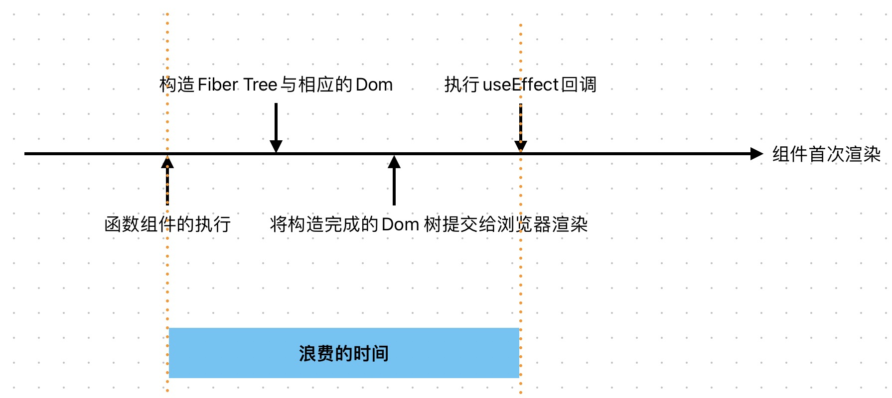

# 什么是请求瀑布流问题

React hooks 的推出将整个 React 生态朝着函数式组件的方向发展，由于函数式组件中没有类似 Class component 中 constructor 的概念，所以组件初始化时需要发起的请求，在 Class component 中是在 constructor 中发起的，而在函数式组件中，我们只能在 useEffect 中发起请求。

但是 useEffect 更像是类组件的 componentDidMount 生命周期，它和 constructor 执行的时机还是有差别的。在 useEffect 中发起的请求，会在组件渲染完成后才会执行，而在 constructor 中发起的请求，会在组件渲染之前就执行。



如果我们的请求不依赖组件的内部状态，只是用来初始化组件内部数据的，我们其实是希望请求发起的时机是在组件初始化的时候，而不是等待组件的渲染完成。

假设我们有一个文章列表页面，根据栏目 id 可以获取文章 id 列表，根据文章 id 可以获取文章详情以及一个文章的评论 id 列表，根据评论 id 可以获取评论详情，那么我们的三个组件大概是这样的：

```jsx
const Category = (props) => {
  const [articleIds, setArticleIds] = useState([]);

  useEffect(() => {
    fetchArticleIds(props.categoryId).then((ids) => {
      setArticleIds(ids);
    });
  }, [props.categoryId]);

  return (
    <div>
      {articleIds.map((id) => {
        return <Article key={id} articleId={id} />;
      })}
    </div>
  );
};
```

```jsx
const Article = (props) => {
  const [article, setArticle] = useState(null);

  useEffect(() => {
    fetchArticle(props.articleId).then((article) => {
      setArticle(article);
    });
  }, [props.articleId]);

  return (
    <div>
      <h1>{article.title}</h1>
      <p>{article.content}</p>
      {article.commentIds.map((id) => {
        return <Comment key={id} commentId={id} />;
      })}
    </div>
  );
};
```

```jsx
const Comment = (props) => {
  const [comment, setComment] = useState(null);

  useEffect(() => {
    fetchComment(props.commentId).then((comment) => {
      setComment(comment);
    });
  }, [props.commentId]);

  return (
    <div>
      <p>{comment.content}</p>
    </div>
  );
};
```

> 在此我们只用这个例子来说明问题，不考虑 api 设计是否合理，以及请求的并发问题。

在这个例子中，我们的页面渲染和请求都是瀑布流的形式，而且是相互耦合的瀑布流，随着组件层级的增加，层级为 N 的组件渲染所需要的时间大概等于 N \* （组件渲染时间 + 请求时间），这样的用户体验是很差的。

这就是所谓的 useEffect 中发起请求导致的瀑布流问题。

# 解决方案

解决思路是将请求的发起和组件的渲染分离，将请求的发起提前到组件初始化的时候。让组件渲染和请求并行执行，而不是串行执行。

那么如何将请求的发起提前到组件初始化的时候呢？我曾经在社区看到过这样奇怪的代码：

```jsx
const Category = (props) => {
  const [articleIds, setArticleIds] = useState([]);
  const initRef = useRef(false);

  if (!initRef.current) {
    fetchArticleIds(props.categoryId).then((ids) => {
      setArticleIds(ids);
    });
    initRef.current = true;
  }

  return (
    <div>
      {articleIds.map((id) => {
        return <Article key={id} articleId={id} />;
      })}
    </div>
  );
};
```

通过 initRef 来标记组件是否已经初始化，如果没有初始化，就发起请求，然后标记为已经初始化。这样的代码看起来很奇怪，而且也不够优雅。

又或者这样：

```jsx
const Category = (props) => {
  const [articleIds, setArticleIds] = useState(() => {
    fetchArticleIds(props.categoryId).then((ids) => {
      setArticleIds(ids);
    });
    return [];
  });

  return (
    <div>
      {articleIds.map((id) => {
        return <Article key={id} articleId={id} />;
      })}
    </div>
  );
};
```

利用 useState 的 初始化函数只在组件初始化的时候执行一次的特性，来发起请求。

上面两种方式虽然可以做到将请求提前到组件初始化的时候，但是都不够优雅，而且也不够通用。更不是 React 官方推荐的方式。

React 官方已经不推荐在 useEffect 中手动来发起请求了。有以下几个原因：

- 本文提到的容易造成请求瀑布流问题
- 直接在 useEffect 中请求数据意味着你没有做预请求和数据缓存
- 不符合人体工程学。需要太多的模板代码来处理一些常见问题和 bug
  - 严格模式下，useEffect 中的请求会被执行两次，需要额外的代码来避免
  - [竞态条件 bug](https://maxrozen.com/race-conditions-fetching-data-react-with-useeffect)
  - 处理 loading 状态、错误状态等

那么 React 官方推荐的方式是什么呢？

React 官方的意思是我的 useEffect 设计的可能有那么点问题，但是社区有很多优秀的框架和请求库已经解决了有关请求的问题，直接用，别自己手动写了。

- 如果使用了 元框架，那么就用它内置的请求库，它们已经解决了所有的问题，比如 Next.js Remix 这些框架自带的请求方法。
- 如果没有使用元框架，那么就用社区的请求库，比如 swr，react-query，react-router 这些库。它们做了很多优化，比如预请求、缓存、错误处理等等。

那么它们是如何解决请求瀑布流问题的呢？

- 对于服务端渲染框架来说，服务端组件不存在请求瀑布流问题，因为服务端渲染的时候，框架使我们可以直接在服务端组件内部发起请求。

- 对于客户端渲染的请求库，它们提供了类似`preload`方法，我们可以在 React 组件外部预先发起请求，然后将请求结果缓存，当组件内部需要请求的数据的时候，先取缓存中获取。这样就可以解决请求瀑布流问题。此外，useSWR 和 react-query 还提供了`suspense`的方式来解决请求瀑布流问题。这也由于 React 18 增强了 Suspense 能力，使其拥有了作为 loading data boundary 的能力。
