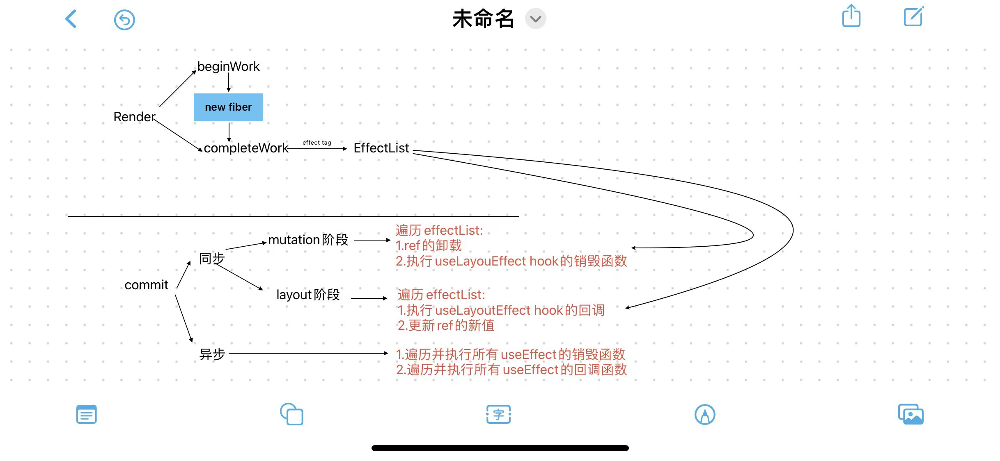

先来看一道题目：

```jsx
const Child = (props) => {
  console.log("render Child");

  const refCallback = useCallback(
    (node) => {
      if (node) {
        console.log("child ref node mount");
      } else {
        console.log("child ref node remove");
      }
    },
    [props.count]
  );

  useLayoutEffect(() => {
    console.log("child layout effect");
    return () => {
      console.log("clear child layout effect");
    };
  }, [props.count]);

  useEffect(() => {
    console.log("child effect ");
    return () => {
      console.log("clear child effect");
    };
  }, [props.count]);
  return <div ref={refCallback}>Child</div>;
};
export const App = () => {
  console.log("render App");
  const [count, setCount] = useState(1);

  const refCallback = useCallback(
    (node) => {
      if (node) {
        console.log("ref node mount");
      } else {
        console.log("ref node remove");
      }
    },
    [count]
  );

  useLayoutEffect(() => {
    console.log("layout effect");
    return () => {
      console.log("clear layout effect");
    };
  }, [count]);

  useEffect(() => {
    console.log("effect ");
    return () => {
      console.log("clear effect");
    };
  }, [count]);

  return (
    <div ref={refCallback}>
      <button onClick={() => setCount((prev) => prev + 1)}>add{count}</button>
      <Child count={count} />
    </div>
  );
};
```

[code sandbox](https://codesandbox.io/s/hooks-timing-x5xclk?file=/src/App.tsx)

当 APP 组件第一次渲染，以及点击 Button 触发 update 时，控制台输出的内容是什么？

大家可以先思考一下，先在纸上写下自己的答案，然后再看下面的答案。

初次渲染：

```txt
render App
render Child
child ref node mount
child layout effect
ref node mount
layout effect
child effect
effect
```

点击 Button 触发 update 时：

```txt
render App
render Child
child ref node remove
clear child layout effect
ref node remove
clear layout effect
child ref node mount
child layout effect
ref node mount
layout effect
clear child effect
clear effect
child effect
effect
```

如果你的答案和上面的不一样，那么接下来我带大家巩固一下 React 函数组件内的一些时间点。

## React 执行流程

React 的执行过程可以分为两个阶段：

- render 阶段：生成 Fiber 树，收集 effect 链表
- commit 阶段：执行 effect 链表，完成 DOM 更新

### render 阶段

render 阶段的工作就是根据组件的调用关系，生成 Fiber 树，这个过程是一个深度优先遍历的过程，从根节点开始，一直遍历到叶子节点，然后再回溯到兄弟节点，再到父节点，再到兄弟节点，再到父节点，直到遍历完整棵树。

“递” 的过程就是构建 Fiber 树，对应的方法是`beginWork`,而“归”的过程就是收集 effect 链表,对应的方法是`completeWork`。

“递” 的过程是自上而下的，而“归”的过程是自下而上的，这也是为什么 React 说函数组件的执行顺序是从上到下，而 useEffect 等等的执行顺序是从下到上的原因。

### commit 阶段

commit 阶段的工作就是执行 effectList 链表，完成 DOM 更新。

commit 阶段又可以主要分为两个阶段：

- mutation 阶段：执行相关的 DOM 操作，同时处理 ref 和 useLayoutEffect 的相关清理工作。

- layout 阶段：执行 useLayoutEffect 的回调函数和 ref 的更新。

在 commit 阶段结束后，就会执行浏览器的绘制操作。然后就会执行 useEffect hook 的相关逻辑。

具体流程如下图所示：



## 题目解析

### 初次渲染

函数组件的执行发生在 render 阶段的 beginWork 方法中，beginWork 在组件树中是自上而下进行的，所以`render App`会先于`render Child`打印。

然后进入 commit 阶段，commit 阶段的操作对象的 effectList ,而 effectList 是在 render 阶段的 completeWork 方法中收集的，completeWork 是自下而上进行的，所以 commit 阶段的所有操作也是自下而上的。

由于是初次渲染，所以不需要执行 ref 和 useLayoutEffect 的清理工作，只需要考虑 layout 阶段。

在 layout 阶段，会自下而上执行 useLayoutEffect 的回调函数和 ref 的更新，因为 ref 挂载的 DOM 对应的 Fiber 节点处于 Function Component 对应的 Fiber 节点的下面，所以按照自上而上的先后顺序，依次打印

```txt
child ref node mount
child layout effect
ref node mount
layout effect
```

最后自下而上异步执行 useEffect 的回调函数，打印

```txt
child effect
effect
```

### 点击 Button 触发 update 时

update 的流程和 初次 mount 的流程大体相同，但是多了一些清理工作。

清理工作发生在 commit 阶段的 mutation 阶段，所以按照自下而上的先后顺序，依次打印：

```txt
child ref node remove
clear child layout effect
ref node remove
clear layout effect
```

然后进入 layout 阶段，按照自上而下的先后顺序，依次打印：

```txt
child ref node mount
child layout effect
ref node mount
layout effect
```

然后进入 useEffect hook 的清理阶段，按照自下而上的先后顺序，依次打印：

```txt
clear child effect
clear effect
```

最后自下而上异步执行 useEffect 的回调函数，打印

```txt
child effect
effect
```

## 总结

1. 函数组件的执行顺序是从上到下的，useEffect/useLayoutEffect/ref 的 销毁函数和回调函数 的执行顺序是从下到上的。

2. 所有组件 useEffect 的销毁函数必须都执行完后才能执行任意一个组件的 useEffect 的回调函数。useLayoutEffect 同理。

3. useEffect 的回调函数是异步执行的，useLayoutEffect 的回调函数是同步执行的。useLayoutEffect 的回调函数执行完后，进入浏览器渲染，渲染完才会执行 useEffect 的回调函数。
