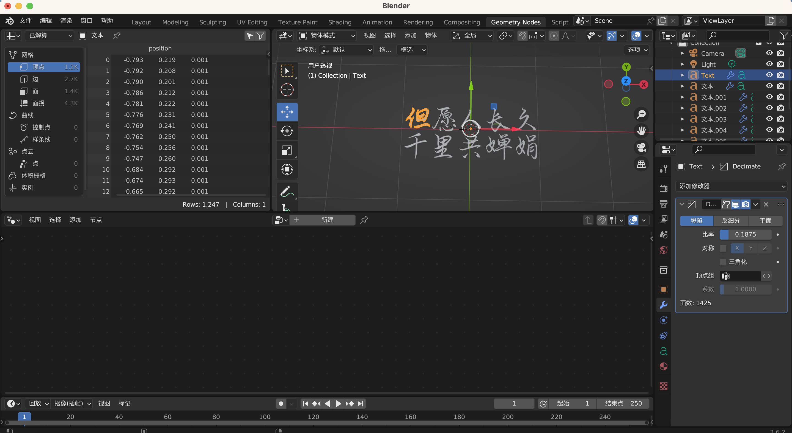

最近看了网剧《西出玉门》，看到里面的粒子皮影戏，重新点燃了我对粒子体系的兴趣，这不中秋节快到了吗，我就用 3D 文字模型的粒子体系去实现一个写诗的动画，祝大家中秋快乐！

本文使用最新版本（r156）的 three.js 库，5 年前我曾写过一篇类似的[粒子动画文章](https://juejin.cn/post/6844903669305966600) 那篇文章中用到的一些 API 已经被废弃了，所以这次我会用最新的 API 来实现类似的粒子动画。

## 实现思路

1. 用 Blender 制作 3D 文字模型
2. 初始化场景、相机、渲染器
3. 创建初始粒子体系
4. 用 Tween.js 将粒子体系的粒子分批移动到文字模型的位置

## 用 Blender 制作 3D 文字模型

参考[这篇文章](https://juejin.cn/post/7067425957421776926?searchId=202309191047097AC6B23009238B733AB2)用 Blender 制作 3D 文字模型，导出为 glTF 格式。几个注意点：

1. 每个文字要单独制作，不能合并，否则导出的模型是多个汉字，而不是一个一个的汉字组成的列表。
2. 文字模型的尺寸、厚度和分辨率要尽可能的小，这样导出的模型才不会太大。
3. 可以通过 Geometry Nodes 查看每个模型的顶点数量，建议每个文字模型的顶点数量在 1000 左右，可以通过添加修改器-精简，来减少顶点数量。文字的导出的时候要勾选`Apply Modifiers`，否则导出的模型还是原来的顶点数量。

最后以“但”这个模型为例，给出我的配置：

深度：0.001

分辨率：1

字体：[行书](https://www.fonts.net.cn/fonts-zh/tag-xingshu-1.html)

尺寸：0.5

x 偏移量：-1m

y 偏移量：0m

添加修改器-精简(Decimate)：塌陷比率 0.1875



## 初始化场景、相机、渲染器

```js
container = document.getElementById("container");

//相机
camera = new THREE.PerspectiveCamera(
  45,
  window.innerWidth / window.innerHeight,
  0.1,
  10000
);
camera.position.set(200, 200, 200);
camera.lookAt(new THREE.Vector3(0, 0, 0));
// 场景
scene = new THREE.Scene();
scene.background = new THREE.Color(0x050505);
//渲染器
renderer = new THREE.WebGLRenderer();
renderer.setPixelRatio(window.devicePixelRatio);
renderer.setSize(window.innerWidth, window.innerHeight);

container.appendChild(renderer.domElement);
```

## 创建初始粒子体系

在 Three.js 中创建粒子体系,需要创建一个 BufferGeometry 对象，然后给这个对象添加顶点属性，最后创建一个 Points 对象，将 BufferGeometry 对象和 PointsMaterial 材质传入，就可以创建一个粒子体系了。

```js
//初始化粒子

const particles = 9308; //粒子数量=文字模型的顶点数量总和

geometry = new THREE.BufferGeometry();

const positions = [];

const n = 500,
  n2 = n / 2; // particles spread in the cube

for (let i = 0; i < particles; i++) {
  // positions

  const x = Math.random() * n - n2;
  const y = Math.random() * n - n2;
  const z = Math.random() * n - n2;

  positions.push(x, y, z);
}

geometry.setAttribute(
  "position",
  new THREE.Float32BufferAttribute(positions, 3)
);

//粒子材质

const material = new THREE.PointsMaterial({
  color: 0xffffff,
  size: 4,
  transparent: true,
  opacity: 0.6,
  sizeAttenuation: true,
  blending: THREE.AdditiveBlending,
  map: generateSprite(), // 粒子的贴图
  depthWrite: false,
});

points = new THREE.Points(geometry, material);
scene.add(points);
```

## 用 Tween.js 将粒子体系的粒子分批移动到文字模型的位置

### 加载文字模型

使用 GLTFLoader 加载文字模型，然后将文字模型的顶点坐标保存到一个数组中。

```js
//load model
const loader = new GLTFLoader();
loader.load("./models/texts4.glb", function (obj) {
  textGeometryList = obj.scene.children;
  // 对每个模型做一些简单形变
  for (let i = 0; i < textGeometryList.length; i++) {
    textGeometryList[i].geometry.scale(100, 100, 100);
    textGeometryList[i].geometry.rotateX(Math.PI / 4);
    textGeometryList[i].geometry.rotateY(Math.PI / 4);
  }
  //模型加载后立即执行动画
  tweenPoints(textGeometryList[textIndex].geometry);
});
```

### 使用 Tween.js 实现动画

使用 Tween.js 实现动画，从初始粒子体系的`geometry`中取出粒子的坐标，然后使用 Tween.js 将粒子移动到文字模型的位置，动画持续 1s,然后还添加了一个 1s 内的随机延时，使得动画效果更 y 有层次。最后再执行下一个文字模型的动画。

`positionAttribute.needsUpdate = true` 这句话是用来更新粒子的位置的，如果不加这句话，粒子的位置就不会更新。

```js
function tweenPoints(geom) {
  for (let i = 0; i < geom.attributes.position.count; i++) {
    let x = geom.attributes.position.array[i * 3];
    let y = geom.attributes.position.array[i * 3 + 1];
    let z = geom.attributes.position.array[i * 3 + 2];
    let ox = geometry.attributes.position.array[(startIndex + i) * 3];
    let oy = geometry.attributes.position.array[(startIndex + i) * 3 + 1];
    let oz = geometry.attributes.position.array[(startIndex + i) * 3 + 2];

    let fromPoint = { x: ox, y: oy, z: oz };
    const positionAttribute = geometry.getAttribute("position");
    const tween = new TWEEN.Tween(fromPoint);
    tween
      .to({ x, y, z }, 1000)
      .easing(TWEEN.Easing.Quadratic.InOut)
      .delay((1000 * i) / geom.attributes.position.count)
      .onUpdate(function () {
        positionAttribute.setXYZ(
          startIndex + i,
          fromPoint.x,
          fromPoint.y,
          fromPoint.z
        );
        positionAttribute.needsUpdate = true; //更新
      })
      .start();
  }
  setTimeout(() => {
    if (textIndex < textGeometryList.length - 1) {
      textIndex++;
      startIndex += geom.attributes.position.count;
      tweenPoints(textGeometryList[textIndex].geometry);
    }
  }, 2000);
}
```

### Tween 的更新

在动画中，需要不断的更新粒子的位置，所以需要在动画循环中调用`TWEEN.update()`方法，这样才能使得动画正常运行。

```js
function animate() {
  TWEEN.update();
  //...
}
```

## 最终效果


[点击预览](https://viewerw.github.io/text-points-animation/)

[github 地址](https://github.com/viewerw/text-points-animation)

## 最后

本人并非专业的 three.js 开发者，折腾了几天，终于实现了这个效果，文中代码可能并非性能最优，如果有什么不足之处，欢迎指正。

如果你喜欢这篇文章，欢迎点赞、评论、收藏。祝大家中秋快乐！
